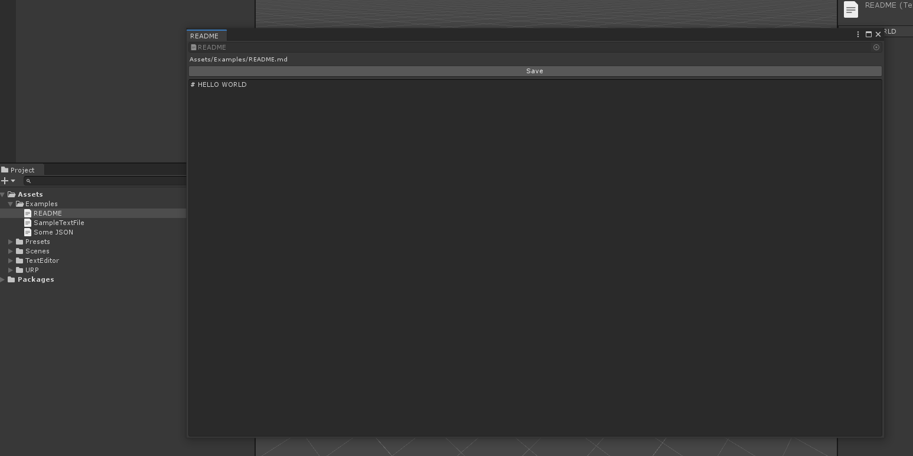

# TextEditor

Simple utility to view and edit text files in editor without third party programs.

## How to create text file

For creating text file use context menu.


## How to edit

Double click on text asset to open edititng window.



## Disabling external tool editing

To disable third party tools go to _Edit/Preferences -> External Tools_ and remove `txt`, `json` and `md` extensions.


## Install


```
{
  "dependencies": {
    "com.fofanius.texteditor": "https://github.com/Fofanius/TextEditor.git#1.0.0",
    
    ...
    *other default and your dependencies*
  }
}
```